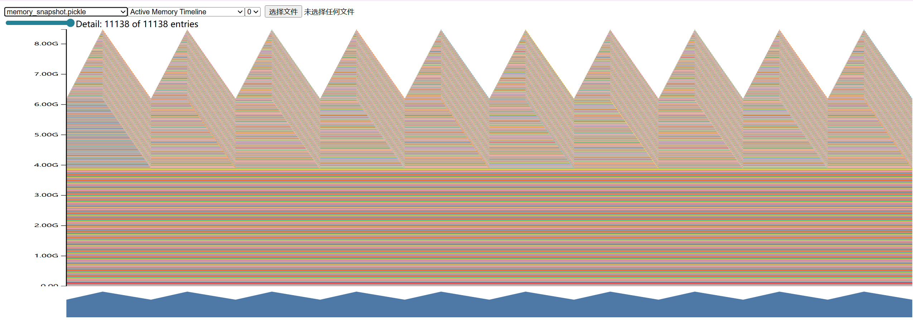
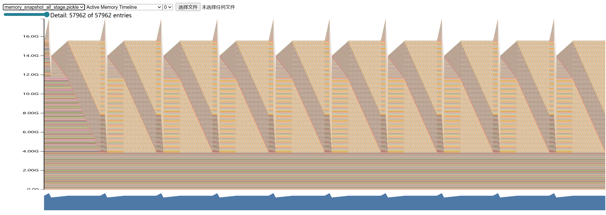
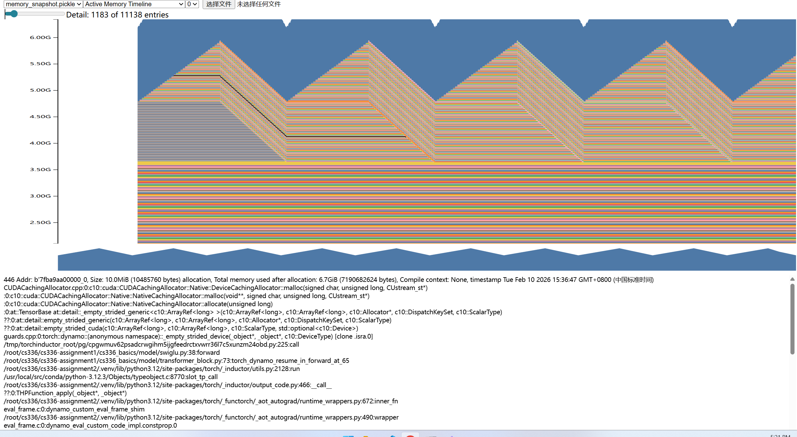

# 1 Assignment Overview

## 1.1 Profiling and Benchmarking

### 1.1.3 End-to-End Benchmarking

(a) 查看 `cs336_systems/benchmark/benchmark.py` 文件。
(b) 是在Batch_size=4, context_length=128的条件下运行的（去除了2.7B那个模型，因为显存不够）。

| 模型   | Forward Pass (秒) | Backward Pass (秒) |
| ------ | ----------------- | ------------------ |
| small  | 0.0187 ± 0.0002   | 0.0423 ± 0.0015    |
| medium | 0.0430 ± 0.0012   | 0.0810 ± 0.0039    |
| large  | 0.0570 ± 0.0012   | 0.1341 ± 0.0070    |
| xl     | 0.0960 ± 0.0024   | 0.1812 ± 0.0037    |

一般来说backward pass(不包括optimizer.step)花费的时间是forward pass的两倍。

(c) 如果没有warming up的步骤，那么第一个前向传播会花费很多时间。
因为模型在第一次运行的时候会把对应的kernel加载到GPU中，以及对内存进行一个预分配之类的操作，这些都需要花时间，如果没有warmup，那么第一次运行的时间需要把这些都考虑进去。
而且没有warmup标准差很大很大。

| 模型   | Forward Pass (秒) | Backward Pass (秒) |
| ------ | ----------------- | ------------------ |
| small  | 1.5542 ± 4.5447   | 0.1017 ± 0.2074    |
| medium | 2.8902 ± 8.5211   | 0.1578 ± 0.2629    |
| large  | 4.2957 ± 12.6866  | 0.2249 ± 0.2539    |
| xl     | 5.5856 ± 16.3981  | 0.3118 ± 0.0337    |

一步warmup的效果也不是很好，标准差依旧很大。 需要多步warmup才能使运行时间稳定下来。

| 模型   | Forward Pass (秒) | Backward Pass (秒) |
| ------ | ----------------- | ------------------ |
| small  | 0.0377 ± 0.0197   | 0.0369 ± 0.0057    |
| medium | 0.0400 ± 0.0127   | 0.0878 ± 0.0006    |
| large  | 0.0785 ± 0.0317   | 0.1114 ± 0.0185    |
| xl     | 0.0984 ± 0.0477   | 0.2043 ± 0.0301    |

### 1.1.4 Nsight Systems Profiler

(a) 在Batch_size=4, context_length=128的条件下运行的

| 模型   | Forward Pass (秒) |
| ------ | ----------------- |
| small  | 0.0256 ± 0.0014   |
| medium | 0.0497 ± 0.0020   |
| large  | 0.0729 ± 0.0063   |
| xl     | 0.1079 ± 0.0023   |

NVTX 测量结果普遍比 timeit 高约 10-30%，这是因为 NVTX 包含了：

- nvtx.range_push/pop 本身的开销

(b) foward pass中最占用时间的kernel是 `void cutlass::Kernel2<cutlass_80_tensorop_s1688gemm_128x128_16x5_tn_align4>(T1::Params)`，占forward pass总时间的的49.2%

backward pass中最占用时间的kernel是 `void cutlass::Kernel2<cutlass_80_tensorop_s1688gemm_256x128_16x3_nt_align4>(T1::Params)`，占总时间的33.9%

forward和backward中最耗时的kernel不完全相同：

- Forward: `cutlass_80_tensorop_s1688gemm_128x128_16x5_tn_align4` (tile size 128x128)
- Backward: `cutlass_80_tensorop_s1688gemm_256x128_16x3_nt_align4` (tile size 256x128)

两者都是Tensor Core GEMM kernel，但针对不同的矩阵形状使用了不同的优化配置。

(c) 

- `triton_poi_fused_mul_sigmoid_8` 占forward pass的4.0%，
- `triton_per_fused_add_div_mean_mul_pow_7` 占forward pass的2.2%

(d) 在一个完整的training step中， `vectorized_elementwise_kernel` 相关的操作占比最多，占用总时间55%，而基本都是optimizer.step()中在调用这些操作。所以optimizer.step()在整个training step中是十分耗时的。而矩阵乘法相关的操作占用的时间为总时间的35%。
在单独的forward pass中，矩阵乘法所花费的时间占比是88.4%，其他的占用都很小。

(e) 在单个自注意力计算中：

| 操作                           | 耗时       | 占比      |
| ------------------------------ | ---------- | --------- |
| **computing attention scores** | 552.600 µs | **48.5%** |
| **computing softmax**          | 210.100 µs | **18.4%** |
| **final matmul**               | 376.800 µs | **33.1%** |

而它们的FLOPs分别是：

| 操作                       | FLOPs            | 占比                                                         |
| -------------------------- | ---------------- | ------------------------------------------------------------ |
| computing attention scores | $2BL^2d_{model}$ | $\frac{2d_{model}}{4d_{model}+5H}$ (约 49.0%, d_{model}=768时) |
| computing softmax          | $5BL^2H$         | $\frac{5H}{4d_{model}+5H}$ (约 1.9%, d_{model}=768时)        |
| final matmul               | $2BL^2d_{model}$ | $\frac{2d_{model}}{4d_{model}+5H}$ (约 49.0%, d_{model}=768时) |

可以看到虽然softmax的FLOPs占比很低，只有1.9%，但是所耗费的时间却占比18.4%，说明对于softmax的优化不够，而矩阵乘法的优化很好。

### 1.1.5 Mixed Precision

**Problem (mixed_precision_accumulation):**
tensor(10.0001)
tensor(9.9531, dtype=torch.float16)
tensor(10.0021)
tensor(10.0021)

累加器需要是高精度的，即使被累加的数是低精度的，因为这样的话被累加的数会被提升到累加器的精度，这样会减少精度损失。

**Problem (benchmarking_mixed_precision):**
(a) 
the model parameters within the autocast context: fp32
the output of the first feed-forward layer (ToyModel.fc1): fp16
the output of layer norm (ToyModel.ln): fp32
the model’s predicted logits: fp16
the loss: fp32
and the model’s gradients: fp32

(b) 在layer norm中需要求平均值和求方差，这些需要对数据进行累加的操作的时候会把数据提升到FP32

(c) 还是需要转化为float32，因为虽然BF16不会让数据溢出，但是精度会存在问题

(d) 

| Model  | d_model | d_ff | layers | heads | Forward (no AMP) | Backward (no AMP) | Forward (AMP)   | Backward (AMP)  |
| ------ | ------: | ---: | -----: | ----: | ---------------- | ----------------- | --------------- | --------------- |
| small  |     768 | 3072 |     12 |    12 | 0.0216 ± 0.0018  | 0.0240 ± 0.0017   | 0.0224 ± 0.0018 | 0.0231 ± 0.0022 |
| medium |    1024 | 4096 |     24 |    16 | 0.0353 ± 0.0025  | 0.0370 ± 0.0010   | 0.0378 ± 0.0009 | 0.0382 ± 0.0040 |
| large  |    1280 | 5120 |     36 |    20 | 0.0556 ± 0.0401  | 0.0461 ± 0.0034   | 0.0522 ± 0.0024 | 0.0525 ± 0.0009 |
| xl     |    1600 | 6400 |     48 |    25 | 0.0429 ± 0.0022  | 0.0787 ± 0.0001   | 0.0520 ± 0.0064 | 0.0675 ± 0.0021 |

使用amp的效果提升不是很明显，可能是由于batch size太小，使用amp带来的开销大于带来的收益。

### 1.1.6 Profiling Memory

**下面的分析都是基于large模型的，因为设备无法支持2.7B模型，所以输出的结果会有些奇怪，不符合直觉。**
(a)

foward:

上升的时候就是forward的过程，因为这个时候会产生很多很多的激活值。forward过程结束之后会把那些激活值释放掉，所以会下降。

foward + backward + optimizer:

显存上升的时候说明模型在foward+backward，然后下降是因为此时梯度已经计算好了，激活值等会被释放，之后显存再次上升以及平坦是optimizer.step()在进行计算。

(b)

| Context length | Forward peak memory | Full training step peak memory |
| -------------- | ------------------- | ------------------------------ |
| 128            | 8.5G                | 18G                            |
| 256            | 14.5G               | 21G                            |

(c)

| Context length | Forward peak memory | Full training step peak memory |
| -------------- | ------------------- | ------------------------------ |
| 128            | 10.3G               | 18.8G                          |

很奇怪的是使用了amp之后，占用显存还增加了。可能是autocast会带来显存开销。

(d)
Using the same reference batch size `B=4` and `d_model=2560` and `context_lenght=128` for 2.7B:

- Elements: $4 \times 128 \times 2560 = 1{,}310{,}720$  
- Bytes: $1{,}310{,}720 \times 4 = 5{,}242{,}880$  
- MB: $5{,}242{,}880 / 1024^2 = 5.0$ MB  

**Answer: 5.0 MB**

(e) 

10MB，来自swiglu

## 1.2 Optimizing Attention with FlashAttention-2

### 1.2.1 Benchmarking PyTorch Attention

**Problem (pytorch_attention)**

(a)

对于3080Ti显卡(12GB)来说，d_model=16 and seq_length=8192就会造成显存不够。

只需要看 `scaled_dot_production_attention` 函数中形状是 `B * S * S` 的矩阵就行，我这里有三个矩阵 `attn_score`, `exp_x` 和 `attn_weight` ，占用了6GB，然后反向传播的时候也会产生6GB的显存，如 `dL/d_{attn_score}`，所以会OOM

我发现我实现的 softmax 不如 `torch.softmax` ，后者只会保留 `attn_weight` ，前者只会使用 `attn_score` 和 `attn_weight` ，所以peak memory是8GB。

## **1.3 Benchmarking JIT-Compiled Attention**

**Problem (torch_compile)**

使用了 `torch.softmax`，d_model=16 and seq_length=8192

(a)

不使用 torch.compile:

Total forward time for 100 runs: 1.6041 seconds
Total backward time for 100 runs: 3.4594 seconds

使用 torch.compile:

Total forward time for 100 runs: 1.1005 seconds
Total backward time for 100 runs: 1.9164 seconds

对于前向传播提升了31%，对于反向传播提升了44.6%

(b)

对于small模型，batch_size=4, context_length=128

不使用 torch.compile:

Average forward time over 10 iterations: 0.0201 seconds ± 0.0008 seconds
Average backward time over 10 iterations: 0.0391 seconds ± 0.0015 seconds

使用 torch.compile:

Average forward time over 10 iterations: 0.0187 seconds ± 0.0011 seconds
Average backward time over 10 iterations: 0.0230 seconds ± 0.0016 seconds

对于前向传播提升了7%，对于反向传播提升了41%。

### **1.3.2 FlashAttention-2 Forward Pass**

**Problem (flash_benchmarking)**

在 `bfloat16` 精度下，Flash Attention 在前向传播中表现出极强的优势，但在部分配置的后向传播（Backward）中出现了性能回退（Speedup < 1.0x）

| **序列长度 N** | **嵌入维度 d** | **Forward (PyTorch/Triton)** | **Backward (PyTorch/Triton)** | **End2End (PyTorch/Triton)** | **E2E 加速比** |
| -------------- | -------------- | ---------------------------- | ----------------------------- | ---------------------------- | -------------- |
| **128**        | 16             | 0.03 / 0.01                  | 0.23 / 0.31                   | 0.87 / 0.58                  | **1.51x**      |
|                | 32             | 0.03 / 0.01                  | 0.28 / 0.26                   | 0.78 / 0.57                  | **1.36x**      |
|                | 64             | 0.06 / 0.01                  | 0.23 / 0.30                   | 0.94 / 0.61                  | **1.54x**      |
|                | 128            | 0.06 / 0.02                  | 0.24 / 0.30                   | 0.74 / 0.51                  | **1.45x**      |
| **256**        | 16             | 0.03 / 0.01                  | 0.29 / 0.35                   | 0.85 / 0.49                  | **1.72x**      |
|                | 32             | 0.03 / 0.01                  | 0.23 / 0.24                   | 0.81 / 0.52                  | **1.55x**      |
|                | 64             | 0.04 / 0.02                  | 0.22 / 0.26                   | 0.76 / 0.59                  | **1.28x**      |
|                | 128            | 0.03 / 0.03                  | 0.23 / 0.31                   | 0.77 / 0.57                  | **1.36x**      |
| **512**        | 16             | 0.04 / 0.02                  | 0.23 / 0.27                   | 0.77 / 0.55                  | **1.39x**      |
|                | 32             | 0.03 / 0.02                  | 0.33 / 0.29                   | 0.78 / 0.59                  | **1.34x**      |
|                | 64             | 0.04 / 0.03                  | 0.25 / 0.30                   | 0.86 / 0.61                  | **1.41x**      |
|                | 128            | 0.04 / 0.05                  | 0.26 / 0.27                   | 0.90 / 0.54                  | **1.67x**      |
| **1024**       | 16             | 0.05 / 0.03                  | 0.30 / 0.29                   | 0.79 / 0.66                  | **1.19x**      |
|                | 32             | 0.05 / 0.04                  | 0.29 / 0.29                   | 0.76 / 0.55                  | **1.38x**      |
|                | 64             | 0.06 / 0.06                  | 0.24 / 0.27                   | 0.84 / 0.55                  | **1.53x**      |
|                | 128            | 0.07 / 0.09                  | 0.27 / 0.23                   | 0.74 / 0.62                  | **1.20x**      |
| **2048**       | 16             | 0.23 / 0.05                  | 0.24 / 0.28                   | 0.85 / 0.57                  | **1.48x**      |
|                | 32             | 0.24 / 0.08                  | 0.28 / 0.31                   | 0.77 / 0.55                  | **1.39x**      |
|                | 64             | 0.26 / 0.11                  | 0.25 / 0.26                   | 0.75 / 0.53                  | **1.43x**      |
|                | 128            | 0.27 / 0.17                  | 0.31 / 0.34                   | 0.76 / 0.55                  | **1.39x**      |
| **4096**       | 16             | 0.68 / 0.13                  | 0.63 / 0.65                   | 1.27 / 0.77                  | **1.64x**      |
|                | 32             | 0.66 / 0.26                  | 0.60 / 0.65                   | 1.24 / 0.89                  | **1.40x**      |
|                | 64             | 0.78 / 0.31                  | 0.94 / 0.72                   | 1.65 / 1.00                  | **1.65x**      |
|                | 128            | 0.81 / 0.65                  | 0.96 / 1.06                   | 1.69 / 1.64                  | **1.03x**      |
| **8192**       | 16             | 2.23 / 0.42                  | 2.17 / 2.34                   | 4.40 / 2.81                  | **1.56x**      |
|                | 32             | 2.23 / 0.75                  | 2.18 / 2.38                   | 4.41 / 3.22                  | **1.37x**      |
|                | 64             | 2.26 / 0.99                  | 2.20 / 2.51                   | 4.51 / 3.61                  | **1.25x**      |
|                | 128            | 2.51 / 2.23                  | 2.74 / 3.53                   | 5.25 / 5.84                  | 0.90x          |
| **16384**      | 16             | 8.43 / 1.48                  | 8.49 / 9.18                   | 16.97 / 10.91                | **1.55x**      |
|                | 32             | 8.42 / 2.66                  | 8.51 / 9.36                   | 17.03 / 12.41                | **1.37x**      |
|                | 64             | 8.62 / 3.36                  | 8.89 / 9.58                   | 17.66 / 13.54                | **1.30x**      |
|                | 128            | 9.63 / 7.81                  | 10.80 / 13.92                 | 20.56 / 21.97                | 0.94x          |

在 `float32` 精度下，Triton 实现的 Flash Attention 展现了更稳定的加速效果，尤其是在长序列（如 $N=16384$）时，前向传播加速比达到了 **10.88x**。

| **序列长度 N** | **嵌入维度 d** | **Forward (PyTorch/Triton)** | **Backward (PyTorch/Triton)** | **End2End (PyTorch/Triton)** | **E2E 加速比** |
| -------------- | -------------- | ---------------------------- | ----------------------------- | ---------------------------- | -------------- |
| **128**        | 16             | 0.03 / 0.01                  | 0.23 / 0.15                   | 0.81 / 0.45                  | **1.79x**      |
|                | 32             | 0.03 / 0.01                  | 0.26 / 0.25                   | 0.82 / 0.52                  | **1.57x**      |
|                | 64             | 0.03 / 0.01                  | 0.19 / 0.16                   | 0.76 / 0.45                  | **1.70x**      |
|                | 128            | 0.03 / 0.01                  | 0.27 / 0.13                   | 0.79 / 0.41                  | **1.93x**      |
| **256**        | 16             | 0.03 / 0.01                  | 0.22 / 0.12                   | 0.90 / 0.46                  | **1.96x**      |
|                | 32             | 0.03 / 0.01                  | 0.25 / 0.21                   | 0.83 / 0.54                  | **1.55x**      |
|                | 64             | 0.04 / 0.02                  | 0.25 / 0.18                   | 0.81 / 0.47                  | **1.72x**      |
|                | 128            | 0.04 / 0.02                  | 0.30 / 0.18                   | 0.79 / 0.45                  | **1.78x**      |
| **512**        | 16             | 0.04 / 0.02                  | 0.25 / 0.19                   | 0.84 / 0.45                  | **1.88x**      |
|                | 32             | 0.04 / 0.02                  | 0.15 / 0.19                   | 0.79 / 0.48                  | **1.65x**      |
|                | 64             | 0.04 / 0.03                  | 0.26 / 0.17                   | 0.77 / 0.47                  | **1.65x**      |
|                | 128            | 0.05 / 0.04                  | 0.24 / 0.21                   | 0.82 / 0.49                  | **1.69x**      |
| **1024**       | 16             | 0.08 / 0.03                  | 0.26 / 0.18                   | 0.79 / 0.45                  | **1.74x**      |
|                | 32             | 0.07 / 0.04                  | 0.26 / 0.18                   | 0.82 / 0.46                  | **1.77x**      |
|                | 64             | 0.09 / 0.05                  | 0.24 / 0.20                   | 0.89 / 0.47                  | **1.89x**      |
|                | 128            | 0.09 / 0.08                  | 0.17 / 0.17                   | 0.80 / 0.42                  | **1.93x**      |
| **2048**       | 16             | 0.30 / 0.05                  | 0.34 / 0.25                   | 0.88 / 0.51                  | **1.72x**      |
|                | 32             | 0.30 / 0.07                  | 0.32 / 0.29                   | 0.81 / 0.49                  | **1.66x**      |
|                | 64             | 0.34 / 0.09                  | 0.41 / 0.32                   | 0.85 / 0.49                  | **1.75x**      |
|                | 128            | 0.36 / 0.15                  | 0.41 / 0.37                   | 0.84 / 0.50                  | **1.67x**      |
| **4096**       | 16             | 1.00 / 0.14                  | 1.15 / 0.82                   | 2.12 / 0.96                  | **2.22x**      |
|                | 32             | 1.00 / 0.20                  | 1.15 / 0.84                   | 2.13 / 1.04                  | **2.06x**      |
|                | 64             | 1.11 / 0.25                  | 1.31 / 1.06                   | 2.38 / 1.31                  | **1.82x**      |
|                | 128            | 1.24 / 0.58                  | 1.68 / 1.40                   | 2.80 / 1.93                  | **1.45x**      |
| **8192**       | 16             | 3.70 / 0.41                  | 4.26 / 3.00                   | 7.97 / 3.46                  | **2.30x**      |
|                | 32             | 3.78 / 0.67                  | 4.35 / 3.14                   | 8.12 / 3.87                  | **2.10x**      |
|                | 64             | 3.83 / 0.90                  | 4.50 / 3.38                   | 8.33 / 4.34                  | **1.92x**      |
|                | 128            | 4.38 / 1.98                  | 5.51 / 4.65                   | 9.88 / 6.77                  | **1.46x**      |
| **16384**      | 16             | 15.38 / 1.41                 | 16.82 / 11.77                 | 32.16 / 13.27                | **2.42x**      |
|                | 32             | 15.81 / 2.42                 | 17.36 / 12.75                 | 33.20 / 15.43                | **2.15x**      |
|                | 64             | 15.83 / 3.20                 | 17.31 / 12.74                 | 33.17 / 16.12                | **2.06x**      |
|                | 128            | 18.02 / 7.08                 | 21.69 / 18.05                 | 39.52 / 26.25                | **1.51x**      |

### **1.3.3 FlashAttention-2 Leaderboard**

# **2 Distributed Data Parallel Training**

## 2.1 Single-Node Distributed Communication in PyTorch

### **2.1.1 Best Practices for Benchmarking Distributed Applications**

Word size: 2, Backend: gloo, Data_size: 1(MB), Average Time: 1.23ms
Word size: 2, Backend: gloo, Data_size: 10(MB), Average Time: 6.47ms
Word size: 2, Backend: gloo, Data_size: 100(MB), Average Time: 55.70ms
Word size: 2, Backend: gloo, Data_size: 1024(MB), Average Time: 836.99ms
Word size: 2, Backend: nccl, Data_size: 1(MB), Average Time: 0.15ms
Word size: 2, Backend: nccl, Data_size: 10(MB), Average Time: 0.81ms
Word size: 2, Backend: nccl, Data_size: 100(MB), Average Time: 7.30ms
Word size: 2, Backend: nccl, Data_size: 1024(MB), Average Time: 71.57ms

**可以看出，nccl的通信效率是gloo的8倍**

Word size: 4, Backend: gloo, Data_size: 1(MB), Average Time: 1.83ms
Word size: 4, Backend: gloo, Data_size: 10(MB), Average Time: 14.30ms
Word size: 4, Backend: gloo, Data_size: 100(MB), Average Time: 117.80ms
Word size: 4, Backend: gloo, Data_size: 1024(MB), Average Time: 966.09ms

Word size: 4, Backend: nccl, Data_size: 1(MB), Average Time: 0.13ms
Word size: 4, Backend: nccl, Data_size: 10(MB), Average Time: 0.72ms
Word size: 4, Backend: nccl, Data_size: 100(MB), Average Time: 7.44ms
Word size: 4, Backend: nccl, Data_size: 1024(MB), Average Time: 68.08ms

**world_size=4的时候，nccl的通信效率是gloo的15倍左右。也就是说随着world_size变大，nccl的通信效率与gloo的通信效率会越来越大**

## **2.2 A Naïve Implementation of Distributed Data Parallel Training**

**Problem (naive_ddp_benchmarking)**

由于显存不够，所以只测试了small模型。

small模型，rank=2，batch_size=4：

Step 0, Global Mean Loss: 6.155954837799072
Step 0, Avg Step Time: 0.1717 seconds, Avg Commuication Time: 0.0839 seconds, Ration: 0.4884
Step 1, Global Mean Loss: 6.322508811950684
Step 1, Avg Step Time: 0.1713 seconds, Avg Commuication Time: 0.0843 seconds, Ration: 0.4919
Step 2, Global Mean Loss: 6.24445915222168
Step 2, Avg Step Time: 0.1728 seconds, Avg Commuication Time: 0.0839 seconds, Ration: 0.4855
Step 3, Global Mean Loss: 5.821563720703125
Step 3, Avg Step Time: 0.1722 seconds, Avg Commuication Time: 0.0831 seconds, Ration: 0.4827
Step 4, Global Mean Loss: 5.919322490692139
Step 4, Avg Step Time: 0.1741 seconds, Avg Commuication Time: 0.0826 seconds, Ration: 0.4741

可以看到通信成本十分的高，对于small模型来说，通信成本占到了总训练时间的50%。

## **2.3 Improving Upon the Minimal DDP Implementation**

### **2.3.1 Reducing the Number of Communication Calls**

**Problem (minimal_ddp_flat_benchmarking)**

下面是对small模型的测试，rank=2，batch_size=4：

Step 0, Global Mean Loss: 6.155954837799072
Step 0, Avg Step Time: 0.1653 seconds, Avg Commuication Time: 0.0775 seconds, Ration: 0.4691
Step 1, Global Mean Loss: 6.322508811950684
Step 1, Avg Step Time: 0.1656 seconds, Avg Commuication Time: 0.0762 seconds, Ration: 0.4599
Step 2, Global Mean Loss: 6.24445915222168
Step 2, Avg Step Time: 0.1612 seconds, Avg Commuication Time: 0.0777 seconds, Ration: 0.4820
Step 3, Global Mean Loss: 5.821563720703125
Step 3, Avg Step Time: 0.1688 seconds, Avg Commuication Time: 0.0772 seconds, Ration: 0.4577
Step 4, Global Mean Loss: 5.919322490692139
Step 4, Avg Step Time: 0.1696 seconds, Avg Commuication Time: 0.0790 seconds, Ration: 0.4660

可以看到提升不是很明显，提升了2%

### **2.3.2 Overlapping Computation with Communication of Individual Parameter Gradients**

**Problem (ddp_overlap_individual_parameters_benchmarking)**

(a)

Step 0, Global Mean Loss: 6.155954837799072
Step 0, Avg Step Time: 0.1342 seconds, Avg Commuication Time: 0.0024 seconds, Ration: 0.0177
Step 1, Global Mean Loss: 6.322508811950684
Step 1, Avg Step Time: 0.1344 seconds, Avg Commuication Time: 0.0028 seconds, Ration: 0.0207
Step 2, Global Mean Loss: 6.24445915222168
Step 2, Avg Step Time: 0.1320 seconds, Avg Commuication Time: 0.0023 seconds, Ration: 0.0177
Step 3, Global Mean Loss: 5.821563720703125
Step 3, Avg Step Time: 0.1392 seconds, Avg Commuication Time: 0.0024 seconds, Ration: 0.0173
Step 4, Global Mean Loss: 5.919322490692139
Step 4, Avg Step Time: 0.1333 seconds, Avg Commuication Time: 0.0031 seconds, Ration: 0.0233

整体训练速度快了 25%，并且通信占比只有1.7%左右。

(b)

initial DDP implementation：

在原始的DDP实现中backward没有通信，而是在gradient_sync中花时间进行通信。

DDP implementation that overlaps backward computation and communication：

可以看到backward中67.1%的时间都在通信上。

这张图说明反向传播和梯度通信是overlap的。

### **2.3.3 Overlapping Computation with Communication of Bucketed Parameter Gradients**

**Problem (ddp_overlap_bucketed)**

(a)

- Measured time per iteration（取 5 step 平均）：
  - no bucketing: **0.1306 s**
  - 1 MB: **0.1314 s**
  - 10 MB: **0.1345 s**
  - 100 MB: **0.1369 s**
  - 1000 MB: **0.1663 s**

使用bucket会是训练时间增长的原因是每次bucket同步的时候需要拷贝一份到buffer中，然后同步完成之后需要拷贝到每个参数的梯度中，这个拷贝会造成时间的开销。还因为bucket size太大，导致需要等待很久才会同步一次，这和反向传播结束后再进行同步类似，所以会导致训练时间增长。

还有一个原因是我使用的是small模型，可能参数量不大导致使用bucket的收益很小。

(b)

通信所花的时间是：
$$
o \cdot n_b+ \frac{s}{n_b \cdot w} \cdot n_b
$$
但由于计算完第一个桶之后就可以开始传输了，并且计算一个桶的时间的等于传输一个桶的时间，所以我们可以覆盖掉 $n_b-1$ 个桶传输的时间。

所以overhead是：
$$
o \cdot n_b+ \frac{s}{n_b \cdot w} 
$$
根据不等式得到最优桶大小是： 
$$
\sqrt{osw}
$$

## **2.4 4D Parallelism**

**Problem (communication_accounting)**

(a)
$$
\text{总显存} = \underbrace{(P \times 16)}_{\text{全模型静态状态}} + \underbrace{\text{num\_blocks} \times [B \times S \times (d_{model} + d_{ff}) \times 2]}_{\text{全模型动态激活值}}
$$
当 $B=4,S=128$ 的时候，总显存是 3284.37 GB，需要 42 张 H100

(b)
$$
\frac{\text{静态总显存} + 0.5 \times \text{激活值总显存}}{N_{FSDP}} + 0.5 \times \text{激活值总显存} < 95 \text{ GB}
$$
计算得到：$N_{FSDP}=37$

(c)

# **3 Optimizer State Sharding**

**Problem (optimizer_state_sharding_accounting)**

(a)

由于显存原因我是用的是small模型。

- 不使用sharded optimizer:

the peak memory usage after model initialization：0.48GB

directly before the optimizer step：2.77GB

directly after the optimizer step：2.77GB

- 使用sharded optimizer:

the peak memory usage after model initialization：0.48GB

directly before the optimizer step：2.34GB

directly after the optimizer step：2.34GB

从结果可以看出，使用sharded optimizer之后显存占用减少了0.4GB，减少了 14%。这是合理的，因为rank=2的话会减少0.4GB(模型显存占用)

我打印了一下不同rank的sharded optimizer的占用显存：

Rank 1, Optimizer state memory usage(GB): 0.4219 GB
Rank 0, Optimizer state memory usage(GB): 0.5364 GB

可以看到每个rank的optmizer的状态和模型的显存大小差不多。

(b)

- **不使用 sharded optimizer** 的平均 Step Time：$0.1300 \text{ s}$
- **使用 sharded optimizer** 的平均 Step Time：$0.1723 \text{ s}$

使用了sharded optimizer后训练时间增加了很正常，因为需要同步不同gpu上的模型参数，通信需要花费时间。

(c)

1. ZeRO stage1不会对每个模型参数进行同步，而是合并成一块一块的进行同步，减少通信开销。
2. 我是按照参数的index来将参数分配到不同的rank上面，而ZeRO stage1会将模型的参数真正均分到每个rank上
3. ZeRO stage1会overlap参数更新和参数同步。